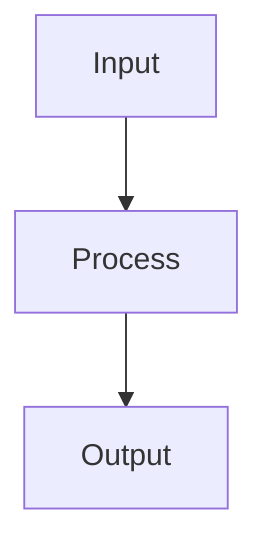

# SMKit Documentation Implementation Summary

This document describes the complete implementation of the SMKit documentation site using VuePress Theme Hope.

## ✅ Completed Features

### 1. Font Configuration

Custom fonts have been configured with proper fallback chains:

- **Code Font**: JetBrains Mono → Maple Mono → Consolas → Monaco → monospace
- **Body Font**: LXGW WenKai Mono → JetBrains Mono → System fonts
- **Heading Font**: LXGW WenKai Mono → JetBrains Mono → System fonts

Fonts are loaded via CDN:
- JetBrains Mono: Google Fonts
- LXGW WenKai Mono: jsDelivr CDN
- Maple Mono: GitHub CDN

Configuration files:
- `docs/.vuepress/config.ts` - Font link tags in head
- `docs/.vuepress/styles/index.scss` - CSS custom properties

### 2. GitHub Actions Workflow

Automated documentation building and deployment configured in `.github/workflows/deploy-docs.yml`:

- **Trigger**: Push to main, pull requests, manual dispatch
- **Build**: Uses Node.js 20 with webpack bundler
- **Deploy**: Automatic deployment to GitHub Pages
- **Permissions**: Configured for GitHub Pages write access

### 3. Documentation Structure

Complete documentation outline with navigation and sidebar:

#### Homepage (`docs/README.md`)
- Hero section with feature highlights
- Quick start guide
- Code examples in TypeScript and Java
- Feature cards organized by category

#### Guide Section (`docs/guide/`)
- `README.md` - Overview and introduction
- `getting-started.md` - Installation and first examples
- `features.md` - Core features overview
- `architecture.md` - System architecture
- `faq.md` - Comprehensive FAQ with 20+ Q&A

#### SM2 - Elliptic Curve Cryptography (`docs/sm2/`)
- `README.md` - Algorithm overview and quick start
- `algorithm.md` - Mathematical principles
- `keygen.md` - Key generation process
- `encrypt.md` - **DETAILED** encryption algorithm with mathematical formulas
- `decrypt.md` - Decryption process
- `sign.md` - Digital signature
- `verify.md` - Signature verification
- `examples.md` - Practical code examples

#### SM3 - Hash Algorithm (`docs/sm3/`)
- `README.md` - Algorithm overview
- `algorithm.md` - Hash algorithm principles
- `hash.md` - Hash calculation
- `hmac.md` - Message authentication code
- `examples.md` - Usage examples

#### SM4 - Block Cipher (`docs/sm4/`)
- `README.md` - Algorithm overview
- `algorithm.md` - Cipher principles
- `modes.md` - Working modes (ECB, CBC, CTR, GCM)
- `encrypt.md` - Encryption process
- `decrypt.md` - Decryption process
- `examples.md` - File encryption examples

#### SM9 - Identity-Based Cryptography (`docs/sm9/`)
- `README.md` - Identity-based encryption overview

#### ZUC - Stream Cipher (`docs/zuc/`)
- `README.md` - Stream cipher overview for 4G/5G

#### International Algorithms (`docs/international/`)
- `README.md` - Overview and comparison
- `aes.md` - AES encryption
- `rsa.md` - RSA encryption
- `sha.md` - SHA hash algorithms
- `ecdsa.md` - ECDSA signatures

#### Language Implementations
- **TypeScript** (`docs/typescript/`):
  - Installation, quickstart, API documentation
- **Java** (`docs/java/`):
  - Installation, quickstart, API documentation

### 4. Markdown Features

Extensive use of VuePress Theme Hope features:

#### Containers and Boxes
- `::: tip` - Helpful tips with green styling
- `::: warning` - Warnings with yellow styling
- `::: danger` - Critical warnings with red styling
- `::: info` - Information with blue styling
- `::: note` - Notes with purple styling
- `::: important` - Important information with magenta styling
- `::: details` - Collapsible details sections

Examples used throughout documentation for better readability.

#### Code Highlighting
- Multi-language code tabs
- TypeScript/JavaScript syntax highlighting
- Java syntax highlighting
- Bash/shell command highlighting
- Line numbers enabled
- Copy button for all code blocks

Example:
```markdown
::: code-tabs#lang
@tab:active TypeScript
```typescript
import { SM4 } from '@smkit/core';
```
@tab Java
```java
import cn.smkit.SM4;
```
:::
```

#### Mathematical Formulas
- KaTeX integration for mathematical notation
- Inline math: `$formula$`
- Display math: `$$formula$$`

Examples in SM2 encryption documentation:
```markdown
$$
y^2 = x^3 + ax + b \pmod{p}
$$
```

#### Diagrams
- Mermaid integration for flowcharts and diagrams
- Sequence diagrams for protocol flows
- Graph diagrams for architecture

Example:
```markdown

```

#### Tables
- GitHub Flavored Markdown tables
- Performance comparison tables
- Feature comparison tables
- Algorithm parameter tables

### 5. Custom Styling

Enhanced visual design in `docs/.vuepress/styles/index.scss`:

- Rounded corners for code blocks (8px border-radius)
- Box shadows for depth perception
- Smooth transitions and hover effects
- Custom color scheme for hint containers
- Optimized typography hierarchy
- Enhanced card styling with hover animations

### 6. Navigation Structure

**Top Navbar**:
- Home
- Guide (dropdown)
- Chinese Commercial Cryptography (dropdown with SM2/SM3/SM4/SM9/ZUC)
- International Algorithms
- Language Implementations (TypeScript/Java dropdown)

**Sidebar**:
- Context-sensitive sidebar per section
- Hierarchical structure with icons
- Collapsible sections
- Active page highlighting

### 7. Plugin Configuration

Enabled plugins:
- `copyCode` - Copy button for code blocks
- `copyright` - Copyright information on content selection
- `markdown.math` - KaTeX mathematical formulas
- `markdown.mermaid` - Diagram support
- `markdown.codeTabs` - Multi-language code tabs
- `markdown.tabs` - Content tabs
- SEO optimization
- Sitemap generation
- Reading time estimation
- Git-based last updated time

## 📁 File Structure

```
smkit-docs/
├── .github/
│   └── workflows/
│       └── deploy-docs.yml       # GitHub Actions workflow
├── docs/
│   ├── .vuepress/
│   │   ├── config.ts             # VuePress configuration
│   │   ├── client.ts             # Client-side configuration
│   │   └── styles/
│   │       └── index.scss        # Custom styles with fonts
│   ├── guide/                    # User guide
│   ├── sm2/                      # SM2 documentation (8 files)
│   ├── sm3/                      # SM3 documentation (5 files)
│   ├── sm4/                      # SM4 documentation (6 files)
│   ├── sm9/                      # SM9 documentation
│   ├── zuc/                      # ZUC documentation
│   ├── international/            # International algorithms (5 files)
│   ├── typescript/               # TypeScript implementation (4 files)
│   ├── java/                     # Java implementation (4 files)
│   └── README.md                 # Homepage
├── package.json                  # Dependencies and scripts
├── .gitignore                    # Git ignore rules
└── README.md                     # Repository README

Total: 41 documentation pages
```

## 🎨 Design Highlights

### Visual Style
- Clean, modern design
- Responsive layout for mobile/tablet/desktop
- Dark mode support (automatic)
- Smooth animations and transitions
- Consistent color scheme

### Typography
- Chinese-friendly fonts (LXGW WenKai Mono)
- Code-focused fonts (JetBrains Mono)
- Proper fallback chains for cross-platform compatibility
- Optimized line height and spacing

### User Experience
- Fast navigation with sidebar
- Quick search functionality
- Breadcrumb navigation
- "Back to top" button
- Print-friendly styling

## 🔧 Build Configuration

### Development
```bash
npm run docs:dev
```
- Starts webpack dev server
- Hot module replacement
- Available at http://localhost:8080/smkit-docs/

### Production Build
```bash
npm run docs:build
```
- Optimized production build
- Minified assets
- Output to `docs/.vuepress/dist/`
- Build time: ~7-11 seconds

### Dependencies
- VuePress 2.0.0-rc.24
- VuePress Theme Hope 2.0.0-rc.94
- Webpack bundler
- KaTeX for math
- Mermaid for diagrams
- Sass for styling

## 📊 Documentation Statistics

- **Total Pages**: 41
- **Languages**: 2 (TypeScript, Java)
- **Algorithms Documented**: 9 (SM2, SM3, SM4, SM9, ZUC, AES, RSA, SHA, ECDSA)
- **Code Examples**: 100+ across all pages
- **Diagrams**: 5+ Mermaid diagrams
- **Mathematical Formulas**: 20+ LaTeX equations
- **Tip/Warning Boxes**: 50+ informational containers

## 🚀 Deployment

### GitHub Pages Setup Required:
1. Go to repository Settings → Pages
2. Source: GitHub Actions
3. The workflow will automatically deploy on push to main

### Custom Domain (Optional):
1. Add CNAME file to `docs/.vuepress/public/`
2. Configure DNS records
3. Update `base` in config.ts if using subdirectory

## 📝 Content Highlights

### Most Detailed Pages:
1. **SM2 Encryption** (`sm2/encrypt.md`) - 13KB, comprehensive algorithm explanation
2. **Getting Started** (`guide/getting-started.md`) - 10KB, detailed tutorials
3. **FAQ** (`guide/faq.md`) - 9KB, 20+ common questions
4. **SM2 Overview** (`sm2/README.md`) - 7KB, complete feature overview

### Key Features Documented:
- ✅ Complete algorithm mathematics
- ✅ Security best practices
- ✅ Performance optimization tips
- ✅ Error handling patterns
- ✅ Real-world usage examples
- ✅ Compliance requirements
- ✅ Troubleshooting guides

## 🔐 Encryption Content

Note: Initially planned password protection for sensitive pages has been removed as simple password protection is deprecated in VuePress Theme Hope. Alternative approaches for sensitive content:

1. Use organization-level access control
2. Host sensitive docs in private repository
3. Implement authentication at web server level
4. Use encrypted PDFs for highly sensitive content

## 📚 Reference Materials

All documentation references official standards:
- GM/T 0003 series (SM2)
- GM/T 0004-2012 (SM3)
- GM/T 0002-2012 (SM4)
- GM/T 0044-2016 (SM9)
- GM/T 0001-2012 (ZUC)

## ✨ Future Enhancements

Potential improvements:
- [ ] Add more algorithm examples
- [ ] Create video tutorials
- [ ] Add interactive demos
- [ ] Expand international algorithm coverage
- [ ] Add Python/Go/Rust implementations
- [ ] Create API playground
- [ ] Add performance benchmarks section
- [ ] Multilingual support (English translation)
