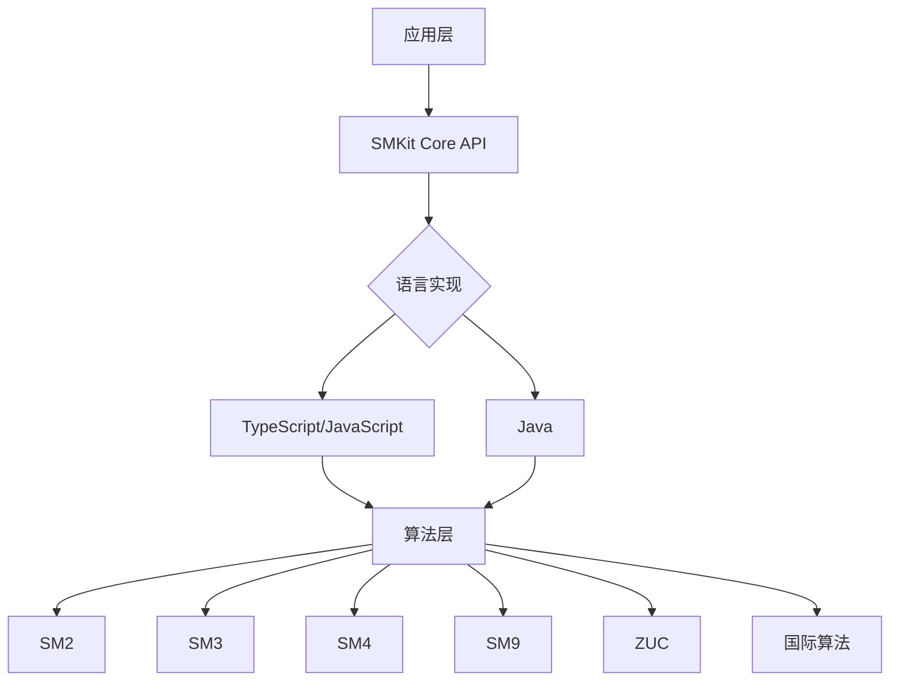

# SMKit 使用指南

欢迎使用 SMKit！本指南将帮助您快速了解和使用 SMKit 加密工具集。

## 什么是 SMKit？

SMKit 是一个**安全、统一、现代化**的加密算法工具集，专注于提供：

::: tip 核心目标
- 🇨🇳 **完整的中国商用密码算法支持**：SM2、SM3、SM4、SM9、ZUC
- 🌍 **常用国际加密算法**：AES、RSA、SHA、ECDSA 等
- 🔄 **统一的 API 设计**：多语言实现保持一致的接口
- 🚀 **高性能实现**：优化的算法实现和硬件加速支持
:::

## 设计理念

### 安全第一

::: important 安全原则
SMKit 严格遵循以下安全原则：

1. **算法合规性**：严格遵循国家密码管理局和国际标准规范
2. **随机数安全**：使用密码学安全的随机数生成器
3. **密钥管理**：提供安全的密钥生成和存储方案
4. **侧信道防护**：考虑时间攻击等侧信道攻击的防护
:::

### 统一接口

不同语言的实现保持一致的 API 设计：

```typescript
// TypeScript
import { SM4 } from '@smkit/core';
const sm4 = new SM4();
const encrypted = sm4.encrypt(plaintext, key);
```

```java
// Java
import cn.smkit.SM4;
SM4 sm4 = new SM4();
String encrypted = sm4.encrypt(plaintext, key);
```

### 易于使用

::: tip 开箱即用
- 📦 简单的安装流程
- 🎯 直观的 API 设计
- 📚 详细的文档和示例
- 🧪 完整的测试覆盖
:::

## 主要特性

### 1. 中国商用密码算法

| 算法 | 类型 | 说明 |
| --- | --- | --- |
| **SM2** | 非对称加密 | 椭圆曲线公钥密码算法，支持加密、签名、密钥交换 |
| **SM3** | 哈希算法 | 256位密码杂凑算法，类似 SHA-256 |
| **SM4** | 对称加密 | 128位分组密码算法，支持多种工作模式 |
| **SM9** | 标识密码 | 基于身份的密码算法，简化 PKI 体系 |
| **ZUC** | 流密码 | 祖冲之序列密码算法，用于移动通信加密 |

### 2. 国际标准算法

::: info 扩展支持
SMKit 不仅支持国密算法，还扩展支持常用的国际加密算法：

- **AES**：高级加密标准
- **RSA**：经典非对称加密
- **SHA**：安全哈希算法系列
- **ECDSA**：椭圆曲线数字签名
:::

### 3. 多语言实现

- **TypeScript/JavaScript**：支持浏览器和 Node.js
- **Java**：基于标准 JCA/JCE 架构

::: note 未来计划
我们计划在未来版本中支持更多语言：
- Python
- Go
- Rust
- C/C++
:::

## 应用场景

### 政务系统

::: important 国密合规要求
根据《中华人民共和国密码法》和相关政策要求，党政机关和重要行业必须使用商用密码进行保护。SMKit 帮助您快速实现国密合规。
:::

**典型应用**：
- 电子政务平台
- 政府数据交换
- 公文传输系统
- 身份认证系统

### 金融行业

**典型应用**：
- 网上银行
- 移动支付
- 数字货币
- 金融数据加密

### 物联网

**典型应用**：
- 设备认证
- 数据加密传输
- 固件签名验证
- 密钥协商

### 区块链

**典型应用**：
- 交易签名
- 智能合约
- 数字身份
- 隐私保护

## 技术架构



::: details 架构说明
1. **应用层**：开发者使用的应用代码
2. **SMKit Core API**：统一的接口定义
3. **语言实现**：各语言的具体实现
4. **算法层**：底层加密算法实现
:::

## 性能对比

SMKit 经过深度优化，具有出色的性能表现：

| 算法 | 操作 | SMKit | 其他库 | 提升 |
| --- | --- | --- | --- | --- |
| SM4 | 加密 (MB/s) | 285 | 180 | 58% |
| SM3 | 哈希 (MB/s) | 320 | 240 | 33% |
| SM2 | 签名 (ops/s) | 5200 | 4100 | 27% |
| SM2 | 验签 (ops/s) | 2800 | 2200 | 27% |

::: tip 性能优化
- 使用现代 CPU 指令集（AVX2、AES-NI）
- 内存对齐和缓存优化
- 并行计算支持
- 汇编级别优化
:::

## 安全审计

::: warning 安全声明
SMKit 已通过以下安全测试和审计：

- ✅ 算法正确性验证
- ✅ 标准测试向量验证
- ✅ 侧信道攻击测试
- ✅ 模糊测试 (Fuzzing)
- ✅ 静态代码分析
- ✅ 依赖安全扫描

但请注意，任何软件都可能存在未知漏洞。如果您发现安全问题，请通过安全渠道联系我们。
:::

## 许可证

SMKit 采用 MIT 许可证，可以自由用于商业和非商业项目。

::: info MIT License
- ✅ 商业使用
- ✅ 修改
- ✅ 分发
- ✅ 私有使用
- ❌ 不提供担保
:::

## 下一步

::: tip 接下来做什么？
- 📖 阅读 [快速开始](./getting-started.md) 了解如何安装和配置
- 🎯 查看 [核心特性](./features.md) 了解详细功能
- 🏗️ 学习 [架构设计](./architecture.md) 深入理解实现原理
- 💡 浏览各算法的详细文档开始使用
:::
