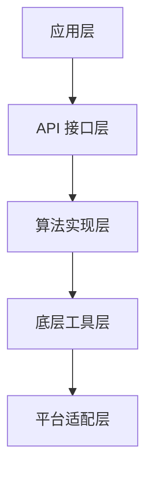

# 架构设计

本文介绍 SMKit 的整体架构设计。

## 分层架构

## 核心模块

### 1. 算法模块

每个加密算法独立封装为模块：

- `@smkit/sm2` - SM2 算法
- `@smkit/sm3` - SM3 算法
- `@smkit/sm4` - SM4 算法
- `@smkit/sm9` - SM9 算法
- `@smkit/zuc` - ZUC 算法

### 2. 工具模块

- `@smkit/utils` - 通用工具函数
- `@smkit/encoding` - 编码转换
- `@smkit/random` - 安全随机数

### 3. 平台适配

- 浏览器环境
- Node.js 环境
- JVM 环境

## 设计原则

::: tip 设计理念
1. **模块化**：每个算法独立，可按需引入
2. **类型安全**：完整的 TypeScript 类型定义
3. **性能优先**：高效的算法实现
4. **安全第一**：遵循最佳安全实践
:::
