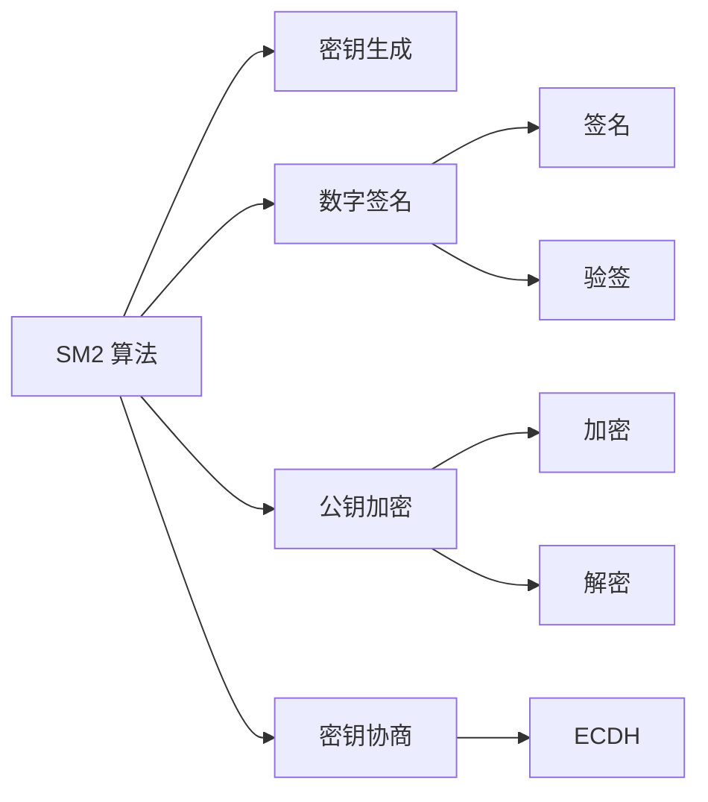
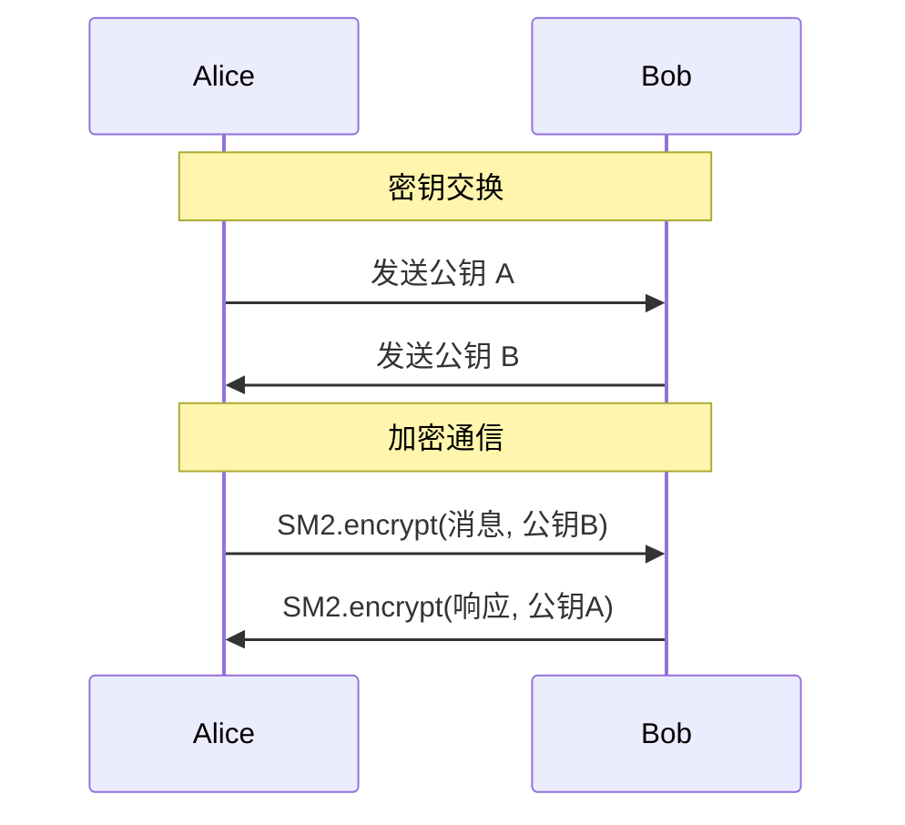

# SM2 椭圆曲线公钥密码算法

SM2 是中国国家密码管理局于 2010 年公布的椭圆曲线公钥密码算法，是一套完整的公钥密码体系。

## 算法概述

::: info SM2 标准
SM2 基于椭圆曲线离散对数问题（ECDLP），是中国商用密码体系的核心算法之一。

**标准文档**：
- GM/T 0003.1-2012：SM2 椭圆曲线公钥密码算法第1部分：总则
- GM/T 0003.2-2012：SM2 椭圆曲线公钥密码算法第2部分：数字签名算法
- GM/T 0003.3-2012：SM2 椭圆曲线公钥密码算法第3部分：密钥交换协议
- GM/T 0003.4-2012：SM2 椭圆曲线公钥密码算法第4部分：公钥加密算法
- GM/T 0003.5-2012：SM2 椭圆曲线公钥密码算法第5部分：参数定义
:::

## 核心特性

### 1. 安全强度

SM2 使用 256 位密钥，安全强度等同于 3072 位 RSA 密钥：

| 算法 | 密钥长度 | 安全强度（位） |
| --- | --- | --- |
| SM2 | 256 bits | ~128 bits |
| RSA | 3072 bits | ~128 bits |
| RSA | 2048 bits | ~112 bits |

::: tip 优势
相比 RSA，SM2 具有以下优势：
- ✅ **更短的密钥长度**：相同安全强度下密钥更短
- ✅ **更快的计算速度**：签名和验签速度更快
- ✅ **更小的证书尺寸**：适合资源受限环境
- ✅ **自主可控**：符合国家密码管理要求
:::

### 2. 椭圆曲线参数

SM2 推荐使用的椭圆曲线参数定义在有限域 $\mathbb{F}_p$ 上：

椭圆曲线方程：

$$
y^2 = x^3 + ax + b \pmod{p}
$$

其中推荐参数为：

$$
\begin{aligned}
p &= \text{FFFFFFFE FFFFFFFF FFFFFFFF FFFFFFFF} \\
  &\quad \text{FFFFFFFF 00000000 FFFFFFFF FFFFFFFF}_{16} \\
a &= \text{FFFFFFFE FFFFFFFF FFFFFFFF FFFFFFFF} \\
  &\quad \text{FFFFFFFF 00000000 FFFFFFFF FFFFFFFC}_{16} \\
b &= \text{28E9FA9E 9D9F5E34 4D5A9E4B CF6509A7} \\
  &\quad \text{F39789F5 15AB8F92 DDBCBD41 4D940E93}_{16}
\end{aligned}
$$

::: details 基点 G 的坐标
基点 $G = (x_G, y_G)$ 的坐标为：

$$
\begin{aligned}
x_G &= \text{32C4AE2C 1F198119 5F990446 6A39C994} \\
    &\quad \text{8FE30BBF F2660BE1 715A4589 334C74C7}_{16} \\
y_G &= \text{BC3736A2 F4F6779C 59BDCEE3 6B692153} \\
    &\quad \text{D0A9877C C62A4740 02DF32E5 2139F0A0}_{16}
\end{aligned}
$$

阶数：
$$
n = \text{FFFFFFFE FFFFFFFF FFFFFFFF FFFFFFFF 7203DF6B 21C6052B 53BBF409 39D54123}_{16}
$$

余因子：$h = 1$
:::

### 3. 主要功能

SM2 算法提供以下核心功能：



## 快速开始

### 基本用法

::: code-tabs#lang

@tab:active TypeScript

```typescript
import { SM2 } from '@smkit/core';

// 创建 SM2 实例
const sm2 = new SM2();

// 1. 生成密钥对
const keyPair = sm2.generateKeyPair();
console.log('公钥:', keyPair.publicKey);
console.log('私钥:', keyPair.privateKey);

// 2. 加密
const message = '这是需要加密的敏感信息';
const ciphertext = sm2.encrypt(message, keyPair.publicKey);
console.log('密文:', ciphertext);

// 3. 解密
const plaintext = sm2.decrypt(ciphertext, keyPair.privateKey);
console.log('明文:', plaintext); // 这是需要加密的敏感信息

// 4. 签名
const data = '需要签名的数据';
const signature = sm2.sign(data, keyPair.privateKey);
console.log('签名:', signature);

// 5. 验签
const isValid = sm2.verify(data, signature, keyPair.publicKey);
console.log('验签结果:', isValid); // true
```

@tab Java

```java
import cn.smkit.SM2;
import cn.smkit.SM2KeyPair;

public class SM2Example {
    public static void main(String[] args) {
        // 创建 SM2 实例
        SM2 sm2 = new SM2();
        
        // 1. 生成密钥对
        SM2KeyPair keyPair = sm2.generateKeyPair();
        System.out.println("公钥: " + keyPair.getPublicKey());
        System.out.println("私钥: " + keyPair.getPrivateKey());
        
        // 2. 加密
        String message = "这是需要加密的敏感信息";
        String ciphertext = sm2.encrypt(message, keyPair.getPublicKey());
        System.out.println("密文: " + ciphertext);
        
        // 3. 解密
        String plaintext = sm2.decrypt(ciphertext, keyPair.getPrivateKey());
        System.out.println("明文: " + plaintext);
        
        // 4. 签名
        String data = "需要签名的数据";
        String signature = sm2.sign(data, keyPair.getPrivateKey());
        System.out.println("签名: " + signature);
        
        // 5. 验签
        boolean isValid = sm2.verify(data, signature, keyPair.getPublicKey());
        System.out.println("验签结果: " + isValid); // true
    }
}
```

:::

### 使用用户 ID

在某些场景下，需要使用用户标识（User ID）：

::: code-tabs#lang

@tab:active TypeScript

```typescript
const sm2 = new SM2();
const userId = '1234567812345678'; // 16字节用户ID

// 带用户ID的签名
const signature = sm2.sign(data, privateKey, { userId });

// 带用户ID的验签
const isValid = sm2.verify(data, signature, publicKey, { userId });
```

@tab Java

```java
SM2 sm2 = new SM2();
String userId = "1234567812345678"; // 16字节用户ID

// 带用户ID的签名
String signature = sm2.sign(data, privateKey, userId);

// 带用户ID的验签
boolean isValid = sm2.verify(data, signature, publicKey, userId);
```

:::

::: note 用户 ID 说明
- 默认用户ID为 `1234567812345678@qq.com`
- 用户ID在计算签名时会参与到哈希计算中
- 确保签名和验签使用相同的用户ID
:::

## 应用场景

### 1. 数字证书

::: tip 应用示例
```typescript
// 生成证书密钥对
const certKeyPair = sm2.generateKeyPair();

// 构建证书请求
const csr = {
  subject: 'CN=Example Corp,O=Example,C=CN',
  publicKey: certKeyPair.publicKey,
  // ... 其他证书信息
};

// CA使用私钥对证书签名
const certSignature = sm2.sign(
  JSON.stringify(csr), 
  caPrivateKey
);
```
:::

### 2. 安全通信



### 3. 数字签名

::: important 应用场景
- **文件签名**：确保文件完整性和来源可信
- **代码签名**：验证软件发布者身份
- **交易签名**：金融交易的不可否认性
- **合同签署**：电子合同的法律效力
:::

## 安全建议

::: danger 安全警告
使用 SM2 时请注意以下安全要点：

1. **密钥保护**
   - 🔒 私钥必须安全存储，建议使用 HSM 或密钥管理服务
   - 🔐 不要在代码中硬编码私钥
   - 🔄 定期轮换密钥对

2. **随机数生成**
   - 🎲 使用密码学安全的随机数生成器
   - ❌ 不要使用伪随机数生成器

3. **参数验证**
   - ✅ 验证所有输入参数的有效性
   - ✅ 检查公钥是否在曲线上
   - ✅ 验证签名格式的正确性

4. **侧信道攻击防护**
   - ⏱️ 使用常量时间算法避免时间攻击
   - 🔋 注意功耗分析攻击
   - 📡 防范电磁辐射泄露
:::

## 性能指标

在主流硬件平台上的性能表现：

| 操作 | Intel i7-12700K | Apple M1 | ARM Cortex-A72 |
| --- | --- | --- | --- |
| 密钥生成 | 8,500 ops/s | 7,200 ops/s | 2,800 ops/s |
| 签名 | 5,200 ops/s | 4,500 ops/s | 1,900 ops/s |
| 验签 | 2,800 ops/s | 2,400 ops/s | 1,100 ops/s |
| 加密 | 3,100 ops/s | 2,700 ops/s | 1,200 ops/s |
| 解密 | 5,800 ops/s | 5,000 ops/s | 2,100 ops/s |

::: tip 性能优化
- 使用预计算点加速标量乘法
- 启用多线程并行处理
- 利用 SIMD 指令集优化
- 批量验签可使用批验证算法
:::

## 深入学习

::: tip 继续了解
- 📖 [算法原理详解](./algorithm.md) - 深入理解 SM2 数学原理
- 🔑 [密钥生成](./keygen.md) - 详细的密钥生成过程
- 🔒 [加密算法](./encrypt.md) - 公钥加密的实现细节
- 🔓 [解密算法](./decrypt.md) - 私钥解密的实现细节
- ✍️ [签名算法](./sign.md) - 数字签名的原理和实现
- ✅ [验签算法](./verify.md) - 签名验证的过程
- 💡 [示例代码](./examples.md) - 更多实用示例
:::

## 标准符合性

SMKit 的 SM2 实现严格遵循以下标准：

::: info 标准列表
- ✅ GM/T 0003.1-2012：SM2椭圆曲线公钥密码算法第1部分：总则
- ✅ GM/T 0003.2-2012：SM2椭圆曲线公钥密码算法第2部分：数字签名算法
- ✅ GM/T 0003.3-2012：SM2椭圆曲线公钥密码算法第3部分：密钥交换协议
- ✅ GM/T 0003.4-2012：SM2椭圆曲线公钥密码算法第4部分：公钥加密算法
- ✅ GM/T 0003.5-2012：SM2椭圆曲线公钥密码算法第5部分：参数定义
- ✅ ISO/IEC 14888-3：签名标准
- ✅ ISO/IEC 18033-2：加密标准
:::

## 测试向量验证

我们使用官方标准文档中的测试向量验证算法正确性：

```typescript
// 示例：使用标准测试向量验证
import { SM2, testVectors } from '@smkit/core';

const sm2 = new SM2();

// 运行所有测试向量
testVectors.sm2.forEach(vector => {
  const result = sm2.verify(
    vector.message,
    vector.signature,
    vector.publicKey
  );
  console.assert(result === true, 'Test vector failed');
});
```

::: note 测试覆盖
- ✅ 密钥生成测试
- ✅ 签名验签测试
- ✅ 加密解密测试
- ✅ 边界条件测试
- ✅ 错误处理测试
:::
