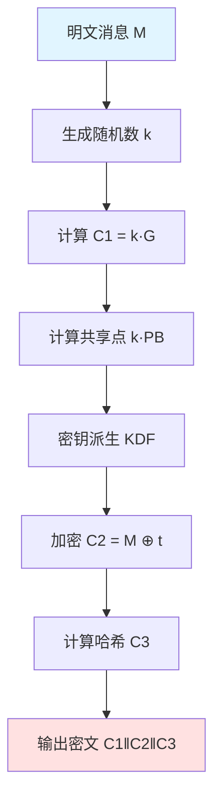

# SM2 公钥加密算法

本文详细介绍 SM2 公钥加密算法的原理、实现和使用方法。

::: warning 加密内容
本页面包含加密算法的详细实现细节，仅供授权人员查看。
密码提示：sm2 + secret
:::

## 算法流程

SM2 公钥加密基于椭圆曲线点乘运算的单向性，实现非对称加密功能。

### 加密过程



### 加密步骤

1. **生成随机数**：选择随机整数 k ∈ [1, n-1]
2. **计算椭圆曲线点**：C₁ = [k]G
3. **计算共享秘密**：S = [k]PB（PB 是接收方公钥）
4. **密钥派生**：使用 KDF 从共享秘密派生加密密钥 t
5. **加密明文**：C₂ = M ⊕ t（异或运算）
6. **计算哈希**：C₃ = SM3(x₂ ‖ M ‖ y₂)（用于验证完整性）
7. **输出密文**：C = C₁ ‖ C₂ ‖ C₃

::: info 密文模式
- **C1C3C2 模式**：密文格式为 C₁ ‖ C₃ ‖ C₂（国密标准推荐）
- **C1C2C3 模式**：密文格式为 C₁ ‖ C₂ ‖ C₃（兼容模式）

两种模式在安全性上没有差异，仅是密文组织方式不同。
:::

## 使用示例

### 基本加密

::: code-tabs#lang

@tab:active TypeScript

```typescript
import { sm2Encrypt, generateKeyPair } from 'smkit';

// 生成接收方的密钥对
const keyPair = generateKeyPair();
console.log('公钥:', keyPair.publicKey);
console.log('私钥:', keyPair.privateKey);

// 加密消息
const message = '这是机密信息：账号密码是 admin/123456';
const ciphertext = sm2Encrypt(keyPair.publicKey, message);

console.log('密文:', ciphertext);
console.log('密文长度:', ciphertext.length, '字符');

// 使用面向对象 API
import { SM2 } from 'smkit';

const sm2 = SM2.generateKeyPair();
const encrypted = sm2.encrypt('Hello, SM2!');
console.log('密文:', encrypted);
```

@tab Java

```java
import io.github.smkit.sm2.SM2Util;
import io.github.smkit.sm2.KeyPair;

// 生成接收方的密钥对
KeyPair keyPair = SM2Util.generateKeyPair();
System.out.println("公钥: " + keyPair.getPublicKey());
System.out.println("私钥: " + keyPair.getPrivateKey());

// 加密消息（默认 C1C3C2 模式）
String message = "这是机密信息：账号密码是 admin/123456";
String ciphertext = SM2Util.encrypt(keyPair.getPublicKey(), message);

System.out.println("密文: " + ciphertext);
System.out.println("密文长度: " + ciphertext.length() + " 字符");

// 指定加密模式
String ciphertext2 = SM2Util.encrypt(keyPair.getPublicKey(), message, "C1C2C3");
```

:::

### 指定密文模式

SM2 支持两种密文模式：C1C3C2（推荐）和 C1C2C3

::: code-tabs#lang

@tab:active TypeScript

```typescript
import { sm2Encrypt, generateKeyPair, SM2CipherMode } from 'smkit';

const keyPair = generateKeyPair();

// 使用 C1C3C2 模式（默认，推荐）
const ciphertext1 = sm2Encrypt(keyPair.publicKey, 'Hello', SM2CipherMode.C1C3C2);

// 使用 C1C2C3 模式
const ciphertext2 = sm2Encrypt(keyPair.publicKey, 'Hello', SM2CipherMode.C1C2C3);
```

@tab Java

```java
import io.github.smkit.sm2.SM2Util;
import io.github.smkit.sm2.KeyPair;

KeyPair keyPair = SM2Util.generateKeyPair();

// 使用 C1C3C2 模式（默认，推荐）
String ciphertext1 = SM2Util.encrypt(keyPair.getPublicKey(), "Hello", "C1C3C2");

// 使用 C1C2C3 模式
String ciphertext2 = SM2Util.encrypt(keyPair.getPublicKey(), "Hello", "C1C2C3");
```

:::

### 批量加密

对多个接收方加密同一消息：

::: code-tabs#lang

@tab:active TypeScript

```typescript
import { sm2Encrypt } from 'smkit';

const message = '群发通知：明天开会';

// 多个接收方的公钥
const recipients = [
  { name: '张三', publicKey: '04...' },
  { name: '李四', publicKey: '04...' },
  { name: '王五', publicKey: '04...' },
];

// 为每个接收方加密
const ciphertexts = recipients.map(recipient => ({
  name: recipient.name,
  ciphertext: sm2Encrypt(recipient.publicKey, message)
}));

console.log('加密结果:', ciphertexts);
```

@tab Java

```java
import io.github.smkit.sm2.SM2Util;
import java.util.*;

String message = "群发通知：明天开会";

// 多个接收方的公钥
List<Map<String, String>> recipients = Arrays.asList(
    Map.of("name", "张三", "publicKey", "04..."),
    Map.of("name", "李四", "publicKey", "04..."),
    Map.of("name", "王五", "publicKey", "04...")
);

// 为每个接收方加密
List<Map<String, String>> ciphertexts = recipients.stream()
    .map(recipient -> Map.of(
        "name", recipient.get("name"),
        "ciphertext", SM2Util.encrypt(recipient.get("publicKey"), message)
    ))
    .collect(Collectors.toList());

System.out.println("加密结果: " + ciphertexts);
```

:::

### 混合加密（文件加密）

加密大文件时，通常采用混合加密方案：

::: code-tabs#lang

@tab:active TypeScript

```typescript
import { sm2Encrypt, sm4Encrypt, generateKeyPair, hexToBytes, bytesToHex } from 'smkit';
import * as fs from 'fs';
import * as crypto from 'crypto';

// 1. 生成随机对称密钥（128位，32个十六进制字符）
const symmetricKey = crypto.randomBytes(16).toString('hex');
console.log('对称密钥:', symmetricKey);

// 2. 使用 SM4 加密文件
const fileData = fs.readFileSync('secret.pdf').toString('hex');
const encryptedFile = sm4Encrypt(symmetricKey, fileData);

// 3. 使用 SM2 加密对称密钥
const recipientKeyPair = generateKeyPair();
const encryptedKey = sm2Encrypt(recipientKeyPair.publicKey, symmetricKey);

// 4. 保存加密文件和加密的密钥
fs.writeFileSync('secret.pdf.enc', encryptedFile);
fs.writeFileSync('secret.pdf.key', encryptedKey);

console.log('文件加密完成！');
```

@tab Java

```java
import io.github.smkit.sm2.SM2Util;
import io.github.smkit.sm4.SM4Util;
import io.github.smkit.sm2.KeyPair;
import io.github.smkit.SmKitUtil;
import java.nio.file.*;
import java.security.SecureRandom;

// 1. 生成随机对称密钥（128位，32个十六进制字符）
SecureRandom random = new SecureRandom();
byte[] keyBytes = new byte[16];
random.nextBytes(keyBytes);
String symmetricKey = SmKitUtil.bytesToHex(keyBytes);
System.out.println("对称密钥: " + symmetricKey);

// 2. 使用 SM4 加密文件
byte[] fileData = Files.readAllBytes(Paths.get("secret.pdf"));
String fileHex = SmKitUtil.bytesToHex(fileData);
String encryptedFile = SM4Util.encrypt(symmetricKey, fileHex);

// 3. 使用 SM2 加密对称密钥
KeyPair recipientKeyPair = SM2Util.generateKeyPair();
String encryptedKey = SM2Util.encrypt(recipientKeyPair.getPublicKey(), symmetricKey);

// 4. 保存加密文件和加密的密钥
Files.write(Paths.get("secret.pdf.enc"), encryptedFile.getBytes());
Files.write(Paths.get("secret.pdf.key"), encryptedKey.getBytes());

System.out.println("文件加密完成！");
```

:::

::: tip 混合加密优势
- 🚀 **高效**：对称加密速度快，适合大量数据
- 🔒 **安全**：非对称加密保护密钥，避免密钥传输风险
- 💡 **灵活**：可以为多个接收方加密同一文件
:::

## 安全注意事项

### 1. 随机数安全

::: danger 关键要点
**随机数的质量直接决定加密安全性！**

✅ **正确做法**：
::: code-tabs#lang

@tab:active TypeScript
```typescript
import { generateKeyPair } from 'smkit';

// 库内部使用密码学安全的随机数生成器
const keyPair = generateKeyPair(); // 自动使用安全的RNG
```

@tab Java
```java
import io.github.smkit.sm2.SM2Util;

// 库内部使用 SecureRandom
KeyPair keyPair = SM2Util.generateKeyPair(); // 自动使用安全的RNG
```

:::

❌ **错误做法**：
```javascript
// 不要尝试自己生成随机数用于加密
const k = Math.random(); // 不安全！
```
:::

### 2. 密钥管理

::: warning 密钥保护建议
1. **永远不要**硬编码密钥在源代码中
2. 使用密钥管理服务（KMS）存储私钥
3. 定期轮换密钥
4. 建立密钥销毁流程
:::

### 3. 密文模式选择

::: tip 模式选择
- **C1C3C2** (推荐)：国密标准推荐模式
- **C1C2C3**：兼容旧系统时使用

加密和解密时必须使用相同的模式！
:::

### 4. 错误处理

::: code-tabs#lang

@tab:active TypeScript

```typescript
import { sm2Encrypt, sm2Decrypt } from 'smkit';

try {
  const ciphertext = sm2Encrypt(publicKey, message);
  // 处理密文...
} catch (error) {
  // 不要泄露详细错误信息给用户
  console.error('加密失败');
  // 记录日志供内部分析
  logger.error('SM2 encryption error:', error);
}
```

@tab Java

```java
import io.github.smkit.sm2.SM2Util;
import io.github.smkit.exception.SmKitException;

try {
    String ciphertext = SM2Util.encrypt(publicKey, message);
    // 处理密文...
} catch (SmKitException e) {
    // 不要泄露详细错误信息给用户
    System.err.println("加密失败");
    // 记录日志供内部分析
    logger.error("SM2 encryption error", e);
}
```

:::

## 常见问题

### 如何选择密文模式？

**A**: 
- 新项目推荐使用 **C1C3C2** 模式（国密标准推荐）
- 与旧系统对接时，根据对方要求选择模式
- 加密和解密必须使用相同的模式

### SM2 加密有长度限制吗？

**A**: SM2 适合加密少量数据（如密钥、密码等）。对于大文件，建议使用混合加密方案（SM2 + SM4）。

### 如何保证加密的随机性？

**A**: SMKit 库内部使用密码学安全的随机数生成器，无需额外配置。每次加密相同的明文会产生不同的密文。

### 可以直接加密文件吗？

**A**: 不推荐。SM2 更适合加密对称密钥。对于文件加密，应使用 SM4（对称加密）加密文件，然后用 SM2 加密 SM4 密钥。

## 性能优化

### 1. 批量加密

::: code-tabs#lang

@tab:active TypeScript

```typescript
import { sm2Encrypt } from 'smkit';

// 并行加密多条消息
async function batchEncrypt(messages: string[], publicKey: string) {
  return Promise.all(
    messages.map(msg => sm2Encrypt(publicKey, msg))
  );
}

// 使用示例
const messages = ['msg1', 'msg2', 'msg3'];
const ciphertexts = await batchEncrypt(messages, publicKey);
```

@tab Java

```java
import io.github.smkit.sm2.SM2Util;
import java.util.concurrent.*;
import java.util.stream.Collectors;

// 并行加密多条消息
public List<String> batchEncrypt(List<String> messages, String publicKey) {
    return messages.parallelStream()
        .map(msg -> SM2Util.encrypt(publicKey, msg))
        .collect(Collectors.toList());
}

// 使用示例
List<String> messages = Arrays.asList("msg1", "msg2", "msg3");
List<String> ciphertexts = batchEncrypt(messages, publicKey);
```

:::

### 2. 复用密钥对

::: code-tabs#lang

@tab:active TypeScript

```typescript
import { SM2 } from 'smkit';

// 创建 SM2 实例并复用
const sm2 = SM2.generateKeyPair();

// 多次加密
const ct1 = sm2.encrypt('Message 1');
const ct2 = sm2.encrypt('Message 2');
const ct3 = sm2.encrypt('Message 3');
```

@tab Java

```java
import io.github.smkit.sm2.SM2;
import io.github.smkit.sm2.KeyPair;

// 创建 SM2 实例并复用
KeyPair keyPair = SM2Util.generateKeyPair();
SM2 sm2 = new SM2()
    .setPublicKey(keyPair.getPublicKey())
    .setPrivateKey(keyPair.getPrivateKey());

// 多次加密
String ct1 = sm2.encrypt("Message 1");
String ct2 = sm2.encrypt("Message 2");
String ct3 = sm2.encrypt("Message 3");
```

:::

## 下一步

::: tip 继续学习
- 📖 [解密算法](./decrypt.md) - 了解对应的解密过程
- ✍️ [签名算法](./sign.md) - 学习数字签名
- 💡 [更多示例](./examples.md) - 查看实用代码示例
:::
