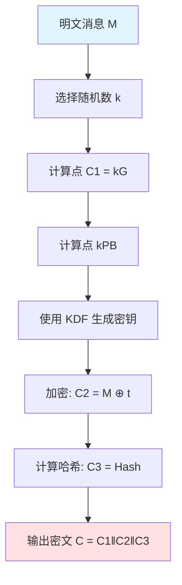

# SM2 公钥加密算法

本文详细介绍 SM2 公钥加密算法的原理、实现和使用方法。

::: warning 加密内容
本页面包含加密算法的详细实现细节，仅供授权人员查看。
密码提示：sm2 + secret
:::

## 算法原理

SM2 公钥加密基于椭圆曲线点乘运算的单向性，实现非对称加密功能。

### 数学基础

椭圆曲线点乘运算定义为：

$$
[k]P = \underbrace{P + P + \cdots + P}_{k \text{ 次}}
$$

其中：
- $P$ 是椭圆曲线上的点
- $k$ 是标量（整数）
- $[k]P$ 是点乘的结果

::: info 单向性
已知 $P$ 和 $[k]P$，在计算上几乎不可能求出 $k$，这就是椭圆曲线离散对数问题（ECDLP）。
:::

### 加密流程



### 加密步骤详解

设：
- 消息发送方为 A
- 消息接收方为 B
- B 的公钥为 $P_B = [d_B]G$，其中 $d_B$ 是私钥
- 待加密的明文为 $M$

**步骤 1**：生成随机数

随机选择整数 $k \in [1, n-1]$

::: tip 随机数要求
- 必须使用密码学安全的随机数生成器
- 每次加密使用不同的随机数（一次一密）
- 不得重复使用随机数
:::

**步骤 2**：计算椭圆曲线点

计算 $C_1 = [k]G = (x_1, y_1)$

其中 $G$ 是椭圆曲线的基点。

**步骤 3**：计算共享秘密

计算 $S = h \cdot [k]P_B$，其中 $h$ 是余因子（SM2 推荐曲线中 $h=1$）

验证 $S$ 不是无穷远点，否则报错。

提取 $S$ 的 $x, y$ 坐标：$S = (x_2, y_2)$

**步骤 4**：密钥派生

使用密钥派生函数（KDF）从共享秘密派生加密密钥：

$$
t = \text{KDF}(x_2 \| y_2, \text{klen})
$$

其中：
- $\text{klen}$ 是明文 $M$ 的比特长度
- $\|$ 表示字符串连接

::: details KDF 函数详解
密钥派生函数（Key Derivation Function）基于 SM3 哈希算法：

```typescript
function KDF(Z: bytes, klen: number): bytes {
  let ct = 1;
  let K = '';
  
  while (K.length < klen) {
    K += SM3.hash(Z + intToBytes(ct));
    ct++;
  }
  
  return K.substring(0, klen);
}
```

算法步骤：
1. 初始化计数器 $ct = 1$
2. 循环计算 $\text{SM3}(Z \| \text{ct})$ 直到输出长度达到 $\text{klen}$
3. 截取前 $\text{klen}$ 位作为派生密钥
:::

验证 $t$ 不是全 0 比特串，否则回到步骤 1。

**步骤 5**：加密明文

计算密文：

$$
C_2 = M \oplus t
$$

::: note 异或运算
$\oplus$ 表示比特异或运算：
- $0 \oplus 0 = 0$
- $0 \oplus 1 = 1$
- $1 \oplus 0 = 1$
- $1 \oplus 1 = 0$

异或运算具有自反性：$(M \oplus t) \oplus t = M$
:::

**步骤 6**：计算哈希值

计算：

$$
C_3 = \text{SM3}(x_2 \| M \| y_2)
$$

这个哈希值用于验证解密后的明文完整性。

**步骤 7**：输出密文

按以下格式输出密文：

$$
C = C_1 \| C_2 \| C_3
$$

其中：
- $C_1$ 长度为 64 字节（两个 256 位坐标）
- $C_2$ 长度等于明文长度
- $C_3$ 长度为 32 字节（SM3 哈希值）

## 实现细节

### TypeScript 实现

::: code-tabs#lang

@tab:active TypeScript

```typescript
import { SM2, SM3, KDF, EllipticCurve } from '@smkit/core';

class SM2Encryptor {
  private curve: EllipticCurve;
  
  constructor() {
    // 使用 SM2 推荐曲线参数
    this.curve = new EllipticCurve({
      p: 'FFFFFFFEFFFFFFFFFFFFFFFFFFFFFFFFFFFFFFFF00000000FFFFFFFFFFFFFFFF',
      a: 'FFFFFFFEFFFFFFFFFFFFFFFFFFFFFFFFFFFFFFFF00000000FFFFFFFFFFFFFFFC',
      b: '28E9FA9E9D9F5E344D5A9E4BCF6509A7F39789F515AB8F92DDBCBD414D940E93',
      Gx: '32C4AE2C1F1981195F9904466A39C9948FE30BBFF2660BE1715A4589334C74C7',
      Gy: 'BC3736A2F4F6779C59BDCEE36B692153D0A9877CC62A474002DF32E52139F0A0',
      n: 'FFFFFFFEFFFFFFFFFFFFFFFFFFFFFFFF7203DF6B21C6052B53BBF40939D54123',
      h: 1
    });
  }
  
  /**
   * SM2 公钥加密
   * @param plaintext 明文（字符串或字节数组）
   * @param publicKey 公钥（16进制字符串）
   * @returns 密文（Base64编码）
   */
  encrypt(plaintext: string | Uint8Array, publicKey: string): string {
    // 1. 将明文转换为字节数组
    const M = typeof plaintext === 'string' 
      ? new TextEncoder().encode(plaintext)
      : plaintext;
    const klen = M.length * 8; // 比特长度
    
    // 2. 解析公钥点
    const PB = this.curve.decodePoint(publicKey);
    
    // 3. 重复直到成功
    while (true) {
      // 3.1 生成随机数 k
      const k = this.curve.randomScalar();
      
      // 3.2 计算 C1 = [k]G
      const C1 = this.curve.multiply(this.curve.G, k);
      
      // 3.3 计算 S = [k]PB
      const S = this.curve.multiply(PB, k);
      
      // 检查 S 是否为无穷远点
      if (S.isInfinity()) {
        continue;
      }
      
      // 3.4 计算密钥派生
      const x2y2 = this.curve.encodePoint(S, false); // 非压缩格式
      const t = KDF(x2y2, klen);
      
      // 检查 t 是否为全0
      if (this.isAllZeros(t)) {
        continue;
      }
      
      // 3.5 计算 C2 = M ⊕ t
      const C2 = this.xor(M, t);
      
      // 3.6 计算 C3 = SM3(x2 || M || y2)
      const hash = new SM3();
      hash.update(S.x.toBytes());
      hash.update(M);
      hash.update(S.y.toBytes());
      const C3 = hash.digest();
      
      // 3.7 输出 C = C1 || C2 || C3
      const C1Bytes = this.curve.encodePoint(C1, false);
      const ciphertext = this.concat(C1Bytes, C2, C3);
      
      return this.toBase64(ciphertext);
    }
  }
  
  /**
   * 字节数组异或运算
   */
  private xor(a: Uint8Array, b: Uint8Array): Uint8Array {
    const result = new Uint8Array(a.length);
    for (let i = 0; i < a.length; i++) {
      result[i] = a[i] ^ b[i];
    }
    return result;
  }
  
  /**
   * 检查是否全为0
   */
  private isAllZeros(bytes: Uint8Array): boolean {
    return bytes.every(b => b === 0);
  }
  
  /**
   * 连接多个字节数组
   */
  private concat(...arrays: Uint8Array[]): Uint8Array {
    const totalLength = arrays.reduce((sum, arr) => sum + arr.length, 0);
    const result = new Uint8Array(totalLength);
    let offset = 0;
    for (const arr of arrays) {
      result.set(arr, offset);
      offset += arr.length;
    }
    return result;
  }
  
  /**
   * Base64 编码
   */
  private toBase64(bytes: Uint8Array): string {
    return btoa(String.fromCharCode(...bytes));
  }
}

// 使用示例
const encryptor = new SM2Encryptor();
const publicKey = '04' + 
  '32C4AE2C1F1981195F9904466A39C9948FE30BBFF2660BE1715A4589334C74C7' +
  'BC3736A2F4F6779C59BDCEE36B692153D0A9877CC62A474002DF32E52139F0A0';

const plaintext = '这是需要加密的机密信息';
const ciphertext = encryptor.encrypt(plaintext, publicKey);
console.log('密文:', ciphertext);
```

@tab Java

```java
import cn.smkit.SM2;
import cn.smkit.SM3;
import cn.smkit.KDF;
import cn.smkit.EllipticCurve;
import java.security.SecureRandom;
import java.math.BigInteger;

public class SM2Encryptor {
    private EllipticCurve curve;
    private SecureRandom random;
    
    public SM2Encryptor() {
        // 初始化椭圆曲线参数
        this.curve = new EllipticCurve(
            new BigInteger("FFFFFFFEFFFFFFFFFFFFFFFFFFFFFFFFFFFFFFFF00000000FFFFFFFFFFFFFFFF", 16),
            new BigInteger("FFFFFFFEFFFFFFFFFFFFFFFFFFFFFFFFFFFFFFFF00000000FFFFFFFFFFFFFFFC", 16),
            new BigInteger("28E9FA9E9D9F5E344D5A9E4BCF6509A7F39789F515AB8F92DDBCBD414D940E93", 16)
        );
        this.random = new SecureRandom();
    }
    
    /**
     * SM2 公钥加密
     * @param plaintext 明文
     * @param publicKey 公钥（16进制字符串）
     * @return 密文（Base64编码）
     */
    public String encrypt(String plaintext, String publicKey) {
        byte[] M = plaintext.getBytes(StandardCharsets.UTF_8);
        int klen = M.length * 8;
        
        // 解析公钥
        ECPoint PB = curve.decodePoint(publicKey);
        
        while (true) {
            // 生成随机数 k
            BigInteger k = curve.randomScalar(random);
            
            // 计算 C1 = [k]G
            ECPoint C1 = curve.multiply(curve.getG(), k);
            
            // 计算 S = [k]PB
            ECPoint S = curve.multiply(PB, k);
            
            if (S.isInfinity()) {
                continue;
            }
            
            // 密钥派生
            byte[] x2y2 = curve.encodePoint(S, false);
            byte[] t = KDF.derive(x2y2, klen);
            
            if (isAllZeros(t)) {
                continue;
            }
            
            // 加密
            byte[] C2 = xor(M, t);
            
            // 计算哈希
            SM3 hash = new SM3();
            hash.update(S.getX().toByteArray());
            hash.update(M);
            hash.update(S.getY().toByteArray());
            byte[] C3 = hash.digest();
            
            // 组装密文
            byte[] C1Bytes = curve.encodePoint(C1, false);
            byte[] ciphertext = concat(C1Bytes, C2, C3);
            
            return Base64.getEncoder().encodeToString(ciphertext);
        }
    }
    
    private byte[] xor(byte[] a, byte[] b) {
        byte[] result = new byte[a.length];
        for (int i = 0; i < a.length; i++) {
            result[i] = (byte)(a[i] ^ b[i]);
        }
        return result;
    }
    
    private boolean isAllZeros(byte[] bytes) {
        for (byte b : bytes) {
            if (b != 0) return false;
        }
        return true;
    }
    
    private byte[] concat(byte[]... arrays) {
        int totalLength = 0;
        for (byte[] arr : arrays) {
            totalLength += arr.length;
        }
        
        byte[] result = new byte[totalLength];
        int offset = 0;
        for (byte[] arr : arrays) {
            System.arraycopy(arr, 0, result, offset, arr.length);
            offset += arr.length;
        }
        return result;
    }
}
```

:::

## 使用示例

### 基本加密

::: code-tabs#example

@tab:active TypeScript

```typescript
import { SM2 } from '@smkit/core';

const sm2 = new SM2();

// 接收方的密钥对
const keyPair = sm2.generateKeyPair();
const publicKey = keyPair.publicKey;

// 加密消息
const message = '这是机密信息：账号密码是 admin/123456';
const ciphertext = sm2.encrypt(message, publicKey);

console.log('密文 (Base64):', ciphertext);
console.log('密文长度:', ciphertext.length, '字节');
```

@tab Java

```java
import cn.smkit.SM2;

SM2 sm2 = new SM2();

// 接收方的密钥对
SM2KeyPair keyPair = sm2.generateKeyPair();
String publicKey = keyPair.getPublicKey();

// 加密消息
String message = "这是机密信息：账号密码是 admin/123456";
String ciphertext = sm2.encrypt(message, publicKey);

System.out.println("密文 (Base64): " + ciphertext);
System.out.println("密文长度: " + ciphertext.length() + " 字节");
```

:::

### 批量加密

对多个接收方加密同一消息：

```typescript
import { SM2 } from '@smkit/core';

const sm2 = new SM2();
const message = '群发通知：明天开会';

// 多个接收方的公钥
const recipients = [
  { name: '张三', publicKey: 'pubkey1...' },
  { name: '李四', publicKey: 'pubkey2...' },
  { name: '王五', publicKey: 'pubkey3...' },
];

// 为每个接收方加密
const ciphertexts = recipients.map(recipient => ({
  name: recipient.name,
  ciphertext: sm2.encrypt(message, recipient.publicKey)
}));

console.log('加密结果:', ciphertexts);
```

### 文件加密

加密大文件时，通常采用混合加密方案：

```typescript
import { SM2, SM4 } from '@smkit/core';
import { randomBytes } from 'crypto';

// 1. 生成随机对称密钥
const symmetricKey = randomBytes(16).toString('hex');

// 2. 使用 SM4 加密文件
const sm4 = new SM4();
const fileData = fs.readFileSync('secret.pdf');
const encryptedFile = sm4.encrypt(fileData, symmetricKey);

// 3. 使用 SM2 加密对称密钥
const sm2 = new SM2();
const encryptedKey = sm2.encrypt(symmetricKey, recipientPublicKey);

// 4. 保存加密文件和加密的密钥
fs.writeFileSync('secret.pdf.enc', encryptedFile);
fs.writeFileSync('secret.pdf.key', encryptedKey);
```

::: tip 混合加密优势
- 🚀 **高效**：对称加密速度快，适合大量数据
- 🔒 **安全**：非对称加密保护密钥，避免密钥传输风险
- 💡 **灵活**：可以为多个接收方加密同一文件
:::

## 安全注意事项

### 1. 随机数安全

::: danger 关键要点
**随机数的质量直接决定加密安全性！**

✅ **正确做法**：
```typescript
import { randomBytes } from 'crypto';
const k = randomBytes(32); // 使用密码学安全的 RNG
```

❌ **错误做法**：
```typescript
const k = Math.random(); // 不安全！不要使用 Math.random()
```
:::

### 2. 密钥管理

::: warning 密钥保护建议
1. **永远不要**硬编码密钥在源代码中
2. 使用密钥管理服务（KMS）存储私钥
3. 定期轮换密钥
4. 建立密钥销毁流程
:::

### 3. 填充攻击防护

虽然 SM2 不使用传统的填充方案，但仍需注意：

- 验证解密后的哈希值 $C_3$
- 不要泄露任何解密错误的详细信息
- 使用常量时间比较避免时序攻击

### 4. 重放攻击防护

在协议设计中添加防重放机制：

```typescript
// 在消息中包含时间戳和随机数
const message = {
  data: 'actual message',
  timestamp: Date.now(),
  nonce: randomBytes(16).toString('hex')
};

const ciphertext = sm2.encrypt(JSON.stringify(message), publicKey);
```

## 性能优化

### 1. 点乘加速

使用窗口法（Window Method）加速点乘运算：

```typescript
class OptimizedSM2 {
  private precomputedPoints: Map<number, ECPoint>;
  
  // 预计算表
  precompute(basePoint: ECPoint, windowSize: number = 4) {
    this.precomputedPoints = new Map();
    for (let i = 0; i < (1 << windowSize); i++) {
      this.precomputedPoints.set(i, this.multiply(basePoint, i));
    }
  }
  
  // 使用预计算表加速点乘
  fastMultiply(k: BigInteger): ECPoint {
    // 使用窗口法实现...
  }
}
```

### 2. 批量加密

并行处理多个加密操作：

```typescript
import { SM2 } from '@smkit/core';
import { Worker } from 'worker_threads';

async function batchEncrypt(messages: string[], publicKeys: string[]) {
  const workers = [];
  const chunkSize = Math.ceil(messages.length / 4); // 4个工作线程
  
  for (let i = 0; i < messages.length; i += chunkSize) {
    const chunk = messages.slice(i, i + chunkSize);
    workers.push(
      new Worker('./encrypt-worker.js', {
        workerData: { messages: chunk, publicKeys }
      })
    );
  }
  
  return Promise.all(workers.map(w => waitForResult(w)));
}
```

## 测试验证

### 标准测试向量

使用 GM/T 0003.4-2012 标准中的测试向量：

```typescript
import { SM2 } from '@smkit/core';

describe('SM2 Encryption', () => {
  it('should pass standard test vectors', () => {
    const sm2 = new SM2();
    
    // 标准测试向量
    const testVector = {
      privateKey: '128B2FA8BD433C6C068C8D803DFF79792A519A55171B1B650C23661D15897263',
      publicKey: '04' +
        '0AE4C7798AA0F119471BEE11825BE46202BB79E2A5844495E97C04FF4DF2548A' +
        '7C0240F88F1CD4E16352A73C17B7F16F07353E53A176D684A9FE0C6BB798E857',
      plaintext: 'encryption standard',
      ciphertext: 'expected_ciphertext_here...'
    };
    
    // 测试加密（使用固定随机数）
    const result = sm2.encrypt(
      testVector.plaintext,
      testVector.publicKey,
      { k: testVector.k } // 测试用固定k
    );
    
    expect(result).toBe(testVector.ciphertext);
  });
});
```

::: tip 测试建议
- ✅ 使用官方标准测试向量
- ✅ 测试边界条件（空消息、最大长度等）
- ✅ 测试错误处理逻辑
- ✅ 进行压力测试和性能测试
:::

## 下一步

::: tip 继续学习
- 📖 [解密算法](./decrypt.md) - 了解对应的解密过程
- ✍️ [签名算法](./sign.md) - 学习数字签名
- 💡 [更多示例](./examples.md) - 查看实用代码示例
:::
